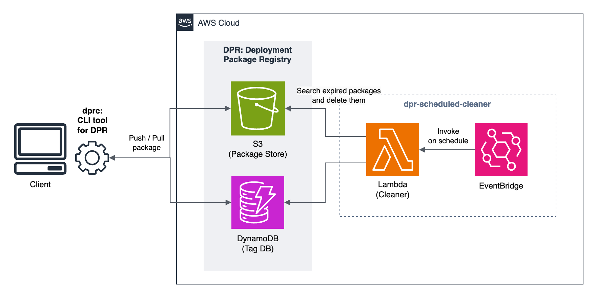

# DPR: Deployment Package Registry

DPR manages deployment packages freely and conveniently with tags, <b>like a container registry</b>. It aims to store files such as AWS Lambda zip archives and static site generation artifacts.

> [!WARNING]
> This project is in Alpha status. We may make disruptive changes without notice. Use in a production environment is at your own risk.

## Components

### DPR

a registry that stores package files with tags

### dprc

CLI tool for DPR

### dpr-scheduled-cleaner

clean the registry regularly according to the lifecycle policy

## Examples of use

- https://github.com/Arthur1/dpr-sample

## License

MIT License

Copyright (c) 2024 ASAKURA Kazuki
